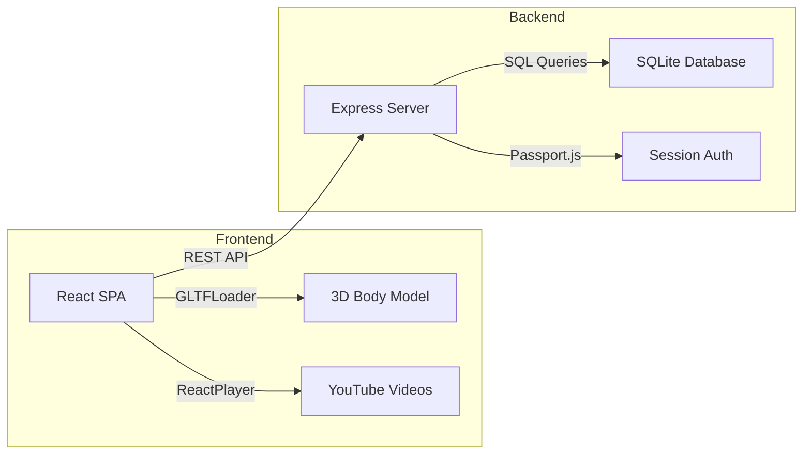

# Gym Tonic

> A fitness web app with an interactive 3D body model for building personalized workout routines, learning exercise technique, and testing knowledge through gamified quizzes.

## Overview

Gym Tonic is a full-stack web application that helps users navigate strength training through an intuitive, body-centric interface. The homepage features a rotatable 3D human model — users tap directly on muscle groups to discover exercises, watch tutorial videos, and build daily workout plans.

The application covers the full fitness learning loop: browse exercises organized by 10 muscle groups, learn proper form through embedded video tutorials and curated tips, build and manage daily training routines, then validate knowledge through multiple-choice quizzes. A gamification layer with four progression tiers (Beginner through Fitness Champion) drives engagement by unlocking quizzes as users complete exercises.

The frontend is built with React and Three.js for the 3D interaction, while the backend runs on Express with SQLite for persistent data storage and Passport.js for session-based authentication.

## Architecture



The client is a single-page React application served by Vite, communicating with the Express backend through a centralized API service layer. The 3D model is loaded as a GLTF asset via React Three Fiber, with each mesh named after a muscle group to enable click-based navigation. The backend follows a DAO pattern — `dao.js` handles all exercise, quiz, and training data, while `user-dao.js` manages authentication. SQLite was chosen for simplicity and zero-configuration deployment, with the database pre-seeded via a SQL initialization script.

## Tech Stack

| Category | Technologies |
|----------|-------------|
| Frontend Framework | React 18, React Router v6 |
| Build Tool | Vite 5 |
| 3D Rendering | Three.js, React Three Fiber, Drei |
| UI Components | Material-UI (MUI) 5, React Bootstrap, styled-components |
| Media | React Player (YouTube embeds) |
| Backend | Node.js, Express 4 |
| Authentication | Passport.js (local strategy), express-session |
| Database | SQLite3 |
| Validation | express-validator |

## Project Structure

```
HCI Code/
├── client/                          # React frontend
│   ├── public/                      # Static assets (3D model, exercise images, badges)
│   │   └── chad.gltf               # Interactive 3D body model
│   ├── src/
│   │   ├── App.jsx                  # Router and top-level state management
│   │   ├── API.js                   # Centralized REST API service layer
│   │   └── components/
│   │       ├── ThreeFiber.jsx       # 3D model rendering and muscle group interaction
│   │       ├── Homepage.jsx         # Landing page with 3D body model
│   │       ├── Exercises.jsx        # Exercise browser by muscle group
│   │       ├── Exercise.jsx         # Exercise detail: video, tips, common mistakes
│   │       ├── DailyTraining.jsx    # Daily workout routine builder
│   │       ├── SwapExercise.jsx     # Exercise swap within same muscle group
│   │       ├── Quiz.jsx             # Quiz list with unlock status
│   │       ├── QuizPage.jsx         # Quiz interface with scoring and level-up
│   │       └── FixedBottomNavigation.jsx  # Bottom navigation bar
│   ├── package.json
│   └── vite.config.js
│
└── server/                          # Express backend
    ├── index.js                     # Server entry point, route definitions, auth setup
    ├── dao.js                       # Data Access Object (exercises, quizzes, training)
    ├── user-dao.js                  # User authentication and credential verification
    ├── db.js                        # SQLite connection
    ├── populatedb.sql               # Database schema and seed data
    ├── gymTonic.db                  # Pre-populated SQLite database
    └── package.json
```

## Features

**Interactive 3D Body Model** — The homepage renders a GLTF human body model using React Three Fiber. Users rotate the model and tap on specific muscle groups (chest, back, biceps, etc.) to view targeted exercises. Each mesh in the 3D model is named to match database muscle group entries, enabling direct click-to-filter mapping.

**Exercise Library** — 12 exercises across 10 muscle groups, each with an embedded YouTube tutorial video, execution tips, and common mistakes to avoid. Exercises can be added to or removed from the daily training plan directly from the detail page.

**Daily Training Planner** — Users build a personalized daily workout by adding exercises from the library. The planner supports marking exercises as completed, swapping an exercise for another targeting the same muscle group, and clearing the entire routine.

**Gamified Quiz System** — Quizzes unlock after completing a threshold of exercises per muscle group (20 completions). Each quiz contains multiple-choice questions about exercise form and anatomy. Scoring 3+ correct answers marks the quiz as passed and increments the user's level. Visual feedback highlights correct and incorrect answers after submission.

**Progression System** — Four achievement tiers with distinct badges: Beginner (levels 0-4), Determined Athlete (5-9), Master of Endurance (10-14), and Fitness Champion (level 15). Badge dialogs appear on level-up, and the current badge is always visible on the homepage.

## Getting Started

### Prerequisites

- [Node.js](https://nodejs.org/) (v16 or higher recommended)

### Installation

```bash
# Clone the repository
git clone https://github.com/Amiamiammo/Gym-Tonic_HCI.git
cd Gym-Tonic_HCI/HCI\ Code

# Install frontend dependencies
cd client
npm install

# Install backend dependencies
cd ../server
npm install
```

### Running the Application

Start both the backend and frontend in separate terminals:

```bash
# Terminal 1 — Backend (port 3001)
cd "HCI Code/server"
node index.js

# Terminal 2 — Frontend (port 5173)
cd "HCI Code/client"
npm run dev
```

Open `http://localhost:5173` in your browser.

### Production Build

```bash
cd "HCI Code/client"
npm run build       # Generates optimized dist/ folder
npm run preview     # Preview the production build locally
```

### Database

The SQLite database (`gymTonic.db`) comes pre-populated with seed data. To reset it, delete the file and re-run the SQL script:

```bash
cd "HCI Code/server"
rm gymTonic.db
sqlite3 gymTonic.db < populatedb.sql
```
